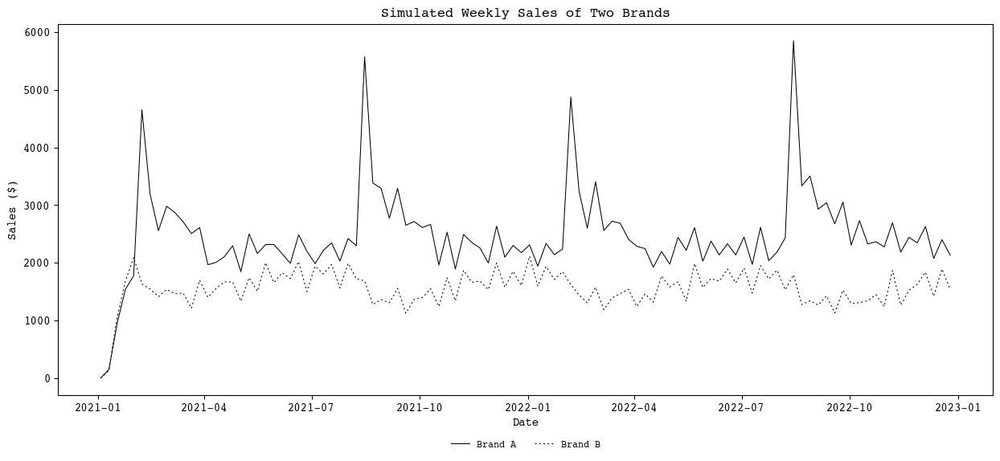

# CABM - Consumer Agent-Based Modeling
## Fully specified and deterministic generative models of retail sales

This library simulates a consumer market using an agent-based modeling approach, where each agent represents a consumer with unique characteristics and behaviors. The model operates as a fully specified generative model for retail sales data, allowing for detailed and granular analysis of market dynamics. By simulating interactions between consumers and the market, the library provides valuable insights into consumer behavior and the effects of various market factors such as advertising and pricing strategies.

## Key Features

- **Agent-Based Simulation**: Each agent in the model simulates a consumer with individual attributes and behaviors. These agents follow a set of rules that govern their interactions with the market, including purchasing decisions, brand preferences, and responses to advertising. This approach allows for a highly detailed and realistic simulation of consumer behavior.

- **Advertising Impact**: The model includes sophisticated mechanisms to simulate the effects of advertising on consumer behavior. It accounts for adstock, which represents the lingering effect of advertising over time, and can model incremental purchases driven by advertising campaigns. This feature helps in understanding the long-term impact of marketing efforts.

- **Price Sensitivity and Elasticity**: Agents in the model can adjust their purchasing behavior based on price changes, allowing for the study of price elasticity. This feature enables the simulation of various pricing strategies and their effects on consumer demand, providing insights into optimal pricing policies.

- **Data Collection and Analysis**: The model includes a robust data collection mechanism that gathers detailed data on agent and model-level variables throughout the simulation. This data can be used for post-processing and analysis, enabling researchers to extract meaningful insights and trends from the simulation results.

- **Configurable Parameters**: The model's behavior can be customized through a variety of configuration options. Users can enable or disable features such as advertising, price comparison, and elasticity. Additionally, parameters such as household sizes, consumption rates, and advertising channel preferences can be specified in a configuration file, allowing for flexible and tailored simulations.

- **Mathematical Tooling**: The library leverages advanced mathematical tools and statistical methods to ensure accurate and reliable simulations. This includes the use of normal and beta distributions for sampling agent attributes, softmax functions for modeling choice probabilities, and various statistical techniques for data analysis.

- **Post-Processing Functions**: The library includes a suite of post-processing functions to analyze and visualize the collected data. These functions can add date columns, calculate total purchases, and generate sales reports, among other tasks. This feature streamlines the analysis process and helps in generating actionable insights from the simulation data.

## Example Usage

```python
import random
import numpy as np
import pandas as pd
import matplotlib.pyplot as plt
import matplotlib as mpl
from cabm import post_processing as ppr

random.seed(2)  # Set the seed "for Python's random module
np.random.seed(3)  # Set the seed for numpy's random module
```


```python
from cabm import cabm_model
```


```python
model = cabm_model.ConsumerModel(1000, "config.toml", enable_ads=True, compare_brand_prices=False, enable_elasticity=False, enable_ad_increment=True)
```

    /Users/michael/Documents/github/consumer-abm/cabm/ad_calendar.py:78: FutureWarning: Downcasting object dtype arrays on .fillna, .ffill, .bfill is deprecated and will change in a future version. Call result.infer_objects(copy=False) instead. To opt-in to the future behavior, set `pd.set_option('future.no_silent_downcasting', True)`
      df = df.fillna(0)
    /Users/michael/Documents/github/consumer-abm/cabm/ad_calendar.py:78: FutureWarning: Downcasting object dtype arrays on .fillna, .ffill, .bfill is deprecated and will change in a future version. Call result.infer_objects(copy=False) instead. To opt-in to the future behavior, set `pd.set_option('future.no_silent_downcasting', True)`
      df = df.fillna(0)
    /Users/michael/.venvs/pydev/lib/python3.12/site-packages/mesa/time.py:82: FutureWarning: The AgentSet is experimental. It may be changed or removed in any and all future releases, including patch releases.
    We would love to hear what you think about this new feature. If you have any thoughts, share them with us here: https://github.com/projectmesa/mesa/discussions/1919
      self._agents: AgentSet = AgentSet(agents, model)


```python
num_steps = 104
for i in range(num_steps):
    model.step()
```


```python
agent_df = model.datacollector.get_agent_vars_dataframe()
```


```python
# Figure setup
# Set the font to Courier
mpl.rcParams['font.family'] = 'Courier'

# Set the line weight to thin
mpl.rcParams['lines.linewidth'] = 0.75

# Set the color scheme to black and white
mpl.rcParams['text.color'] = 'black'
mpl.rcParams['axes.labelcolor'] = 'black'
mpl.rcParams['xtick.color'] = 'black'
mpl.rcParams['ytick.color'] = 'black'
mpl.rcParams['axes.edgecolor'] = 'black'
```


```python
agent_df = ppr.add_date_column(agent_df)
```


```python
data_A = ppr.calculate_total_purchases(agent_df, ['price_A','tv_A','web_A', 'price_B', 'tv_B', 'web_B'], ['Total_Purchases_A', 'Total_Purchases_B'])
```


```python
data_A = ppr.add_total_sales_columns(data_A, ['Total_Purchases_A', 'Total_Purchases_B'],  ['price_A','price_B'],)
```


```python
data_A = ppr.ensure_float_columns(data_A, exclude_columns=['Date','Step'])
```


```python
# Create the plot
plt.figure(figsize=(15,6))

plt.plot(data_A['Date'], data_A['Total_Sales_A'], label='Brand A', color='black')
plt.plot(data_A['Date'], data_A['Total_Sales_B'], label='Brand B', color='black', linestyle='--', dashes=[2,3])

plt.title('Simulated Weekly Sales of Two Brands')
plt.xlabel('Date')
plt.ylabel('Sales ($)')
plt.legend(loc='upper center', bbox_to_anchor=(0.5, -0.10), ncol=2, fontsize='small', frameon=False)

#plt.savefig("A_elast.png", dpi=200)
plt.show()
```


    

    


```python

```
## Example Config File

``` toml
title = "Consumer Model"

[household]
# Number of persons in household - approx percentage for 1,2...7 people in USA - from Statista
household_sizes = [1,2,3,4,5,6,7]
household_size_distribution = [0.28,0.36,0.15,0.12,0.06,0.02,0.01]

# Consumption rate: number of steps per person neded to consume 1 product
# E.g. a consumption rate of 3 means that a product is consumed by one person in 3 steps
# Concretely, that could mean a tube of toothpaste takes 3 weeks to use per person
# Consumption rates are defined statistically via absolute value of a normal distribution
base_consumption_rate = 3
consumption_rate_override = 0

# Pantry minimum percent (percent of household size)
pantry_min_percent = 0.1 # when pantry drops below 10% of household size, consumer must buy to replenish

base_channel_preferences = {TV = 0.20, Web = 0.80} # if using other channels, add them here - must sum to 1

ad_decay_factor = 2.0 # the higher the number, the faster the adstock decay, this just divides the adstock by the number each week
ad_decay_override = 0
adstock_incremental_sensitivty = 1.0 # controls how steep probability curve is that agent will purchase incremental units
adstock_incremental_midpoint = 1000.0 # adstock level at which there is 50% chance agent will purchase incremental units

# Purchase loyalty - upper and lower bounds for beta distribution over agents
loyalty_alpha = 20
loyalty_beta = 2
loyalty_rate_override = 0

# Purchase history window range - after x purchases of brand y, brand preference is set to y
purchase_history_range_lower = 3
purchase_history_range_upper = 6 # uses python range so will be n-1


# Price elasticity config mean values - via get_probability_of_change_in_units_purchased_due_to_price()
price_increase_sensitivity = 5
price_decrease_sensitivity = 10
price_threshold = 0.01

[brands]
# Base product price - the sticker price of a product
# Promo calendar - WARNING - this is a misnomer, it actually just a price multiplier (increasse or discount) for the stated period (campaign)
# Current market share - the percentage of the market that a brand currently has
# Advertising budget - the amount of money spent on advertising
# Advertising channels - the channels that a brand advertises on
# Advertising priority - the percentage of the budget that is spent on each channel
# Advertising campaigns - the campaigns that a brand runs, specifically the week numbers it is active
# Advertising spend structure - how budget is allocated over the course of a campaign

[brands.A]
name = "Brand A"
current_market_share = 0.50
base_product_price = 5.0
[brands.A.promotions]
promo_calendar = {spring_sale = 0.90, back_to_school = 1.1} # 0.9 is a 10% discount, 1.1 is a 10% increase
[brands.A.advertising]
budget = 1000000.0
channels = ["TV", "Web"]
priority = {TV = 50, Web = 50}
ad_campaigns = {TV = "quick_lag_2", Web = "back_to_school"}

[brands.B]
name = "Brand B"
current_market_share = 0.5
base_product_price = 5.0
[brands.B.promotions]
promo_calendar = {holiday_season = 0.0, summer_sale = 0.0}
[brands.B.advertising]
budget = 0.0
channels = ["TV", "Web"]
priority = {TV = 20, Web = 80}
ad_campaigns = {TV = "spring_sale", Web = "holiday_season"}

# You can add additional brands here

[campaign_library]
first_three_weeks_per_quarter = [1, 2, 3, 14, 15, 16, 27, 28, 29, 40, 41, 42]
holiday_season = [47, 48, 49, 50]
back_to_school = [32, 33, 34, 35]
summer_sale = [27, 28, 29, 30]
black_friday = [47]
spring_sale = [15, 16, 17, 18]  
valentines_day = [6, 7]  
easter_holiday = [13, 14]  
halloween = [44]  
cyber_monday = [48] 
# You can add custom campaigns here
quick_lag = [3,4,5]
quick_lag_2 = [5,6,7,8]
```